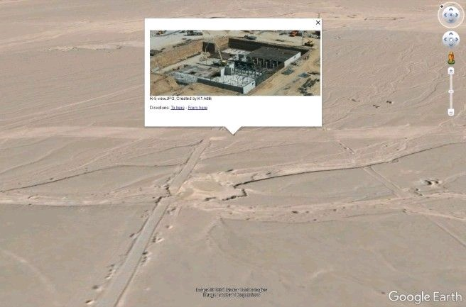

# Pic2KML

با این برنامه می‌تونی مختصات GPS داخل عکس‌هات (متادیتای EXIF) رو استخراج کنی و از روی یک پوشه عکس، فایل‌های `.kml` بسازی؛ این فایل‌ها رو می‌تونی داخل **Google Earth** باز کنی و محل دقیق گرفتن هر عکس رو روی نقشه ببینی.



## ویژگی‌ها

- خواندن مختصات GPS (طول و عرض جغرافیایی) از EXIF عکس‌های `.jpg`، `.jpeg` و `.png`
- ساخت یک فایل `.kml` مستقل برای هر عکس (با آیکون و پیش‌نمایش تصویر)، دقیقاً مثل نسخهٔ قبلی
- **جدید:** ساخت یک فایل ترکیبی `all_photos.kml` که همهٔ عکس‌های پوشه رو یک‌جا روی نقشه نشون می‌ده
- **جدید:** کاملاً کراس‌پلتفرم — روی ویندوز، مک و لینوکس یکسان کار می‌کنه (دیگه به `\` هاردکد‌شده وابسته نیست)
- **جدید:** اجرا هم با پنجرهٔ انتخاب پوشه (GUI) و هم از خط فرمان با آرگومان `--folder` ممکنه
- **جدید:** پیام‌های واضح در ترمینال برای هر عکس (موفق / رد شده و دلیلش) به‌جای بلعیدن خطا با `except` خالی
- عبور امن از عکس‌هایی که مختصات GPS ندارند یا EXIF خراب دارند، بدون متوقف کردن اجرای برنامه

## پیش‌نیازها

- Python 3.8+
- کتابخانه‌های زیر (داخل `requirements.txt`):
  - `Pillow` (اجباری — برای خواندن EXIF)
  - `easygui` (اختیاری — فقط اگر بخوای پوشه رو با پنجرهٔ گرافیکی انتخاب کنی)

## نصب

```bash
git clone https://github.com/k1adili/pic2kml.git
cd pic2kml
pip install -r requirements.txt
```

## نحوه استفاده

### با پنجرهٔ انتخاب پوشه (مثل قبل)

```bash
python main.py
```

یک پنجره برای انتخاب پوشه باز می‌شود؛ پوشه‌ای که عکس‌هات داخلشه رو انتخاب کن.

### از خط فرمان (بدون نیاز به easygui)

```bash
python main.py --folder /path/to/photos
```

### بدون ساخت فایل جداگانه برای هر عکس (فقط فایل ترکیبی)

```bash
python main.py --folder /path/to/photos --no-individual
```

در هر حالت، برنامه:

1. تمام فایل‌های `.jpg`، `.jpeg` و `.png` داخل آن پوشه را پیدا می‌کند.
2. مختصات GPS هر عکس را از EXIF آن استخراج می‌کند.
3. (به‌طور پیش‌فرض) برای هر عکس یک فایل `.kml` هم‌نام در همان پوشه می‌سازد.
4. یک فایل `all_photos.kml` هم می‌سازد که همهٔ عکس‌های geotag‌شده رو با هم نشون می‌ده.

فایل‌های `.kml` تولیدشده را می‌توانی مستقیماً در Google Earth (نسخهٔ دسکتاپ یا وب) باز کنی.

## ساختار پروژه

| فایل | توضیح |
|---|---|
| `main.py` | نقطهٔ ورود برنامه؛ پوشه را می‌خواند، حلقه روی عکس‌ها می‌زند و فایل‌های KML (تکی و ترکیبی) را می‌سازد |
| `k1gpsData.py` | تابع `gps_data()` برای استخراج طول و عرض جغرافیایی (به درجهٔ اعشاری) از EXIF عکس |
| `requirements.txt` | وابستگی‌های پروژه |

## توسعه‌دهنده

ساخته شده توسط **کیوان عدیلی (Keyvan Adili)**
